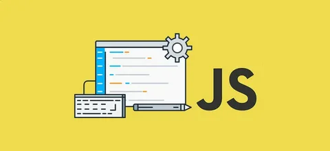
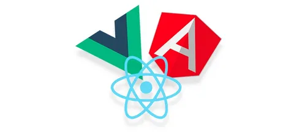
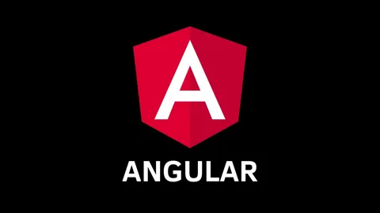
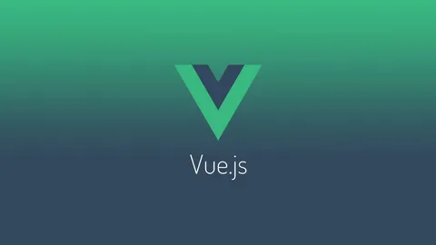

# Введение в JavaScript

### Давайте посмотрим, что такого особенного в JavaScript, чего можно достичь с его помощью и какие другие технологии хорошо с ним работают.
# Что такое JavaScript?
### Изначально JavaScript был создан, чтобы «сделать веб-страницы живыми».
### Программы на этом языке называются скриптами. Они могут встраиваться в HTML и выполняться автоматически при загрузке веб-страницы.
### Скрипты распространяются и выполняются, как простой текст. Им не нужна специальная подготовка или компиляция для запуска.
### Сегодня JavaScript может выполняться не только в браузере, но и на сервере или на любом другом устройстве, которое имеет специальную программу, называющуюся «движком» JavaScript.
### У браузера есть собственный движок, который иногда называют «виртуальная машина JavaScript».
### Самая первая реализация JavaScript была создана Бренданом Эйхом (англ. Brendan Eich) в компании Netscape, и с тех пор обновляется, чтобы соответствовать ECMA-262 Edition 5 и более поздним версиям. Этот движок называется SpiderMonkey и реализован на языке C/C++. Движок Rhino создан Норрисом Бойдом (англ. Norris Boyd) и реализован на языке Java. Как и SpiderMonkey, Rhino соответствует ECMA-262 Edition 5.

### Первоначально по предложению Марка Андрессена[20] язык был назван Mocha[21][22][23], был реализован Бренданом Эйхом в течение десяти дней и впервые был включен в пре-альфу версию Netscape 2[20]. 
### Затем он был переименован в LiveScript[23][24] и предназначался как для программирования на стороне клиента, так и для программирования на стороне сервера (там он должен был называться LiveWire)[19]. На синтаксис оказали влияние языки Си и Java, и, поскольку Java в то время было модным словом[16][19], 4 декабря 1995 года LiveScript переименовали в JavaScript[25], получив соответствующую лицензию у Sun. Анонс JavaScript со стороны представителей Netscape и Sun состоялся накануне выпуска второй бета-версии Netscape Navigator[16]. В нём декларируется, что 28 лидирующих ИТ-компаний выразили намерение использовать в своих будущих продуктах JavaScript как объектный скриптовый язык с открытым стандартом.
# JavaScript-фреймворк

## JavaScript-фреймворки — это библиотеки программирования JavaScript, в которых есть предварительно написанный код для использования в стандартных функциях и задачах программирования. Они служат основой для создания веб-сайтов и веб-приложений.
## Вот некоторые популярные фреймворки JavaScript:
### 1. React.
### 2. Angular.
### 3. Vue.js.
### 4. JQuery.
### 5. Backbone.js.
### 6. Node.js.
### 7. Ember.js.
## Использование фреймворков JavaScript позволяет значительно облегчить работу, так как они содержат готовые к использованию функции и шаблоны.
## AngularJS

## Фреймворк для создания SPA, включает в себя инструменты для разработки и тестирования, реализует архитектуры MVC и MVVM, имеет открытый исходный код.
## Vue.js

## Также фреймворк для создания SPA, реализует шаблон MVVM, имеет открытый исходный код.